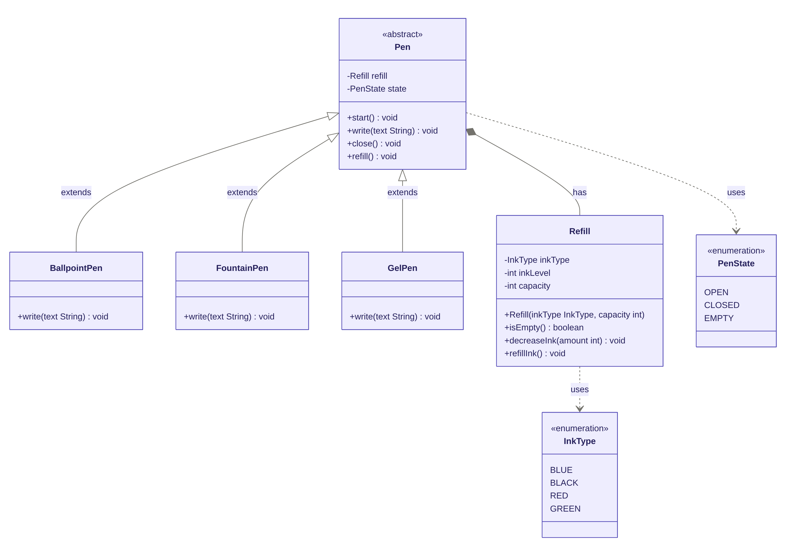

# Design a Pen — LLD

## Class Diagram



---

## Design Decisions

| Concept | Choice | Reason |
|---|---|---|
| `Pen` is abstract | Template Method pattern | Forces subclasses to implement `write()` while sharing lifecycle logic (`start`, `close`, `refill`) |
| `PenState` enum | State pattern (lightweight) | Makes valid transitions explicit and avoids boolean flags |
| `Refill` as separate class | Single Responsibility | Ink management is independent of pen type; enables easy swapping |
| `InkType` enum | Open/Closed | New colours can be added without touching existing code |

---

## Project Structure

```
design-a-pen/
├── pen_lld_class_diagram.png
├── README.md
└── src/
    ├── enums/
    │   ├── InkType.java
    │   └── PenState.java
    ├── Refill.java
    ├── Pen.java           ← abstract
    ├── BallpointPen.java
    ├── FountainPen.java
    ├── GelPen.java
    └── Main.java          ← demo driver
```

---

## How to Run

```bash
cd design-a-pen/src
javac -d out enums/*.java Refill.java Pen.java BallpointPen.java FountainPen.java GelPen.java Main.java
java -cp out Main
```

### Expected Output

```
Pen is now open.
[BallpointPen] Writing: Hello from BallpointPen!
Pen is now closed.
Pen is now open.
[FountainPen] Writing: Hello from FountainPen!
Pen is now closed.
Pen is now open.
[GelPen] Writing: Hello from GelPen!
Refill restored to full capacity.
Pen is now open.
[GelPen] Writing: Writing again after refill!
Pen is now closed.
```
