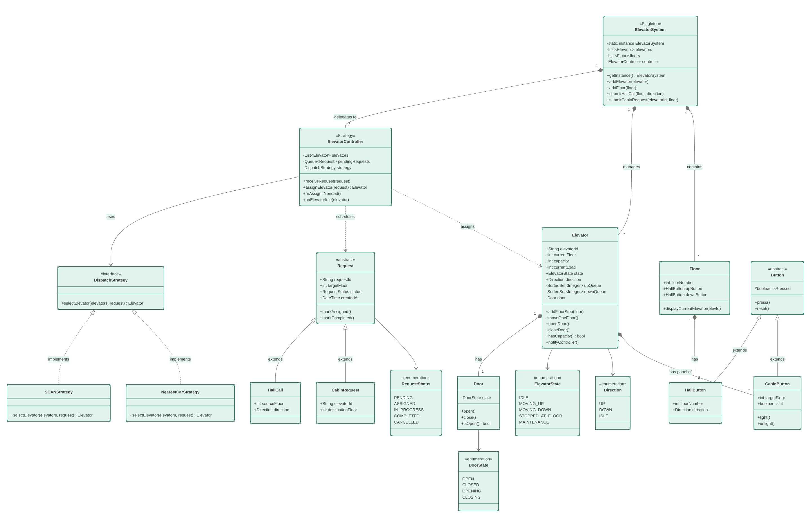

# Elevator System — LLD

## Class Diagram



---

## Design & Approach

### Request Types

| Type | Class | Who sends it | Description |
|---|---|---|---|
| External (Hall Call) | `HallCall` | User on a floor | Presses UP/DOWN button in the hallway |
| Internal (Cabin Request) | `CabinRequest` | User inside elevator | Presses a destination floor button |

Both are received by `ElevatorSystem`, which dispatches them to the best available elevator via the configured strategy.

---

### Elevator Selection — Strategy Pattern

The `ElevatorStrategy` interface decouples the assignment algorithm from the system. Two implementations are provided:

| Strategy | Logic |
|---|---|
| `NearestFloorStrategy` | Picks the elevator with the shortest distance to the target floor |
| `ScanStrategy` | LOOK-aware: gives a cost bonus to elevators already heading toward the target floor, penalises elevators moving away |

Swap strategies at construction time:
```java
new ElevatorSystem(new ScanStrategy());    // default
new ElevatorSystem(new NearestFloorStrategy());
```

---

### Movement — LOOK Algorithm

Each `Elevator` maintains two queues:

- `upQueue` — floors to serve while going UP (ascending `TreeSet`)
- `downQueue` — floors to serve while going DOWN (descending `TreeSet`)

When `move()` is called:
1. If moving UP (or IDLE), serve the next floor in `upQueue`.
2. If `upQueue` is empty, reverse direction and serve `downQueue`.
3. The same logic applies symmetrically for DOWN.

This mirrors how a real elevator works — it exhausts all requests in one direction before reversing, minimising unnecessary travel.

---

### Capacity

Each elevator has a `capacity`. `canAccommodate()` is checked before any assignment. Strategies skip elevators that are full.

---

### Class Responsibilities

| Class | Responsibility |
|---|---|
| `ElevatorSystem` | Central controller — receives requests, selects elevator, triggers execution |
| `ElevatorController` | Drives a single elevator: step-by-step movement, door open/close |
| `Elevator` | State and queue management — LOOK algorithm, floor queues, load tracking |
| `Floor` | Holds UP and DOWN `Button` instances |
| `Button` | Tracks pressed/reset state for a hall button |
| `HallCall` | External request: floor number + direction |
| `CabinRequest` | Internal request: elevator ID + destination floor |
| `ElevatorStrategy` | Interface for elevator selection algorithms |
| `NearestFloorStrategy` | Selects closest idle/moving elevator |
| `ScanStrategy` | LOOK-aware selection — prefers elevators en route |

---

## Project Structure

```
elevator/
├── elevator_system_uml.png
├── README.md
└── src/
    ├── enums/
    │   ├── Direction.java        (UP, DOWN, IDLE)
    │   └── ElevatorState.java    (MOVING, IDLE, STOPPED)
    ├── Button.java
    ├── Floor.java
    ├── HallCall.java
    ├── CabinRequest.java
    ├── Elevator.java
    ├── ElevatorController.java
    ├── ElevatorStrategy.java
    ├── NearestFloorStrategy.java
    ├── ScanStrategy.java
    ├── ElevatorSystem.java
    └── ElevatorMain.java
```

---

## How to Run

```bash
cd elevator/src

javac -d out enums/*.java ElevatorStrategy.java Elevator.java ElevatorController.java \
  NearestFloorStrategy.java ScanStrategy.java Button.java Floor.java \
  HallCall.java CabinRequest.java ElevatorSystem.java ElevatorMain.java

java -cp out ElevatorMain
```
