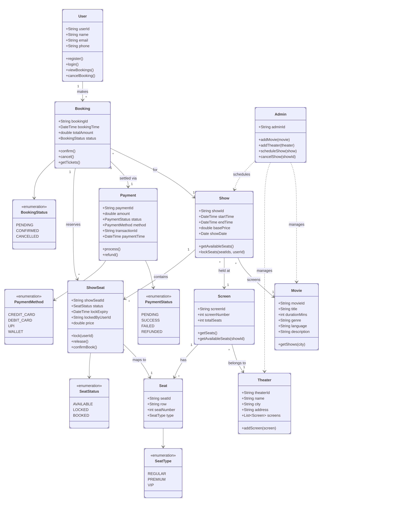

# Movie Ticket Booking System — LLD

## Class Diagram



---

## Design & Approach

### Actors

| Actor | Class | Responsibilities |
|---|---|---|
| Customer | `User` | Browse movies, book tickets, cancel bookings |
| Admin | `Admin` | Add movies, add theaters, schedule/cancel shows |
| System | `BookingService` | Orchestrates all operations, enforces business rules |

---

### Booking Flow (3 Phases)

```
User selects seats
      │
      ▼
Phase 1 — LOCK (ShowSeat.lock)
  Seats transition AVAILABLE → LOCKED
  A 10-minute payment window begins
  Any seat already locked → entire batch rolled back
      │
      ▼
Phase 2 — PAYMENT (Payment.process)
  Calls payment gateway
  On failure → all seats unlocked → booking cancelled
      │
      ▼
Phase 3 — CONFIRM (Booking.confirm)
  Seats transition LOCKED → BOOKED
  Booking stored, user notified
```

---

### Concurrency & Race Conditions

The critical section is `ShowSeat.lock()` — marked `synchronized` so only one thread can acquire a seat at a time.

```
Thread A (User 1) ──► lock(seat-B1) ──► acquires lock ──► proceeds to payment
Thread B (User 2) ──► lock(seat-B1) ──► seat is LOCKED  ──► throws exception
                                         (batch rolled back for User 2)
```

Additional safeguards:
- **Lock expiry**: If a user locks seats but doesn't pay within 10 minutes, the lock is treated as AVAILABLE for the next user.
- **Batch atomicity**: If any seat in a batch fails to lock, all previously locked seats in that batch are immediately released.

---

### Pricing

Billing is based on `SeatType`, not the movie or show:

| Seat Type | Multiplier | Example (base ₹200) |
|---|---|---|
| REGULAR | 1.0× | ₹200 |
| PREMIUM | 1.5× | ₹300 |
| VIP | 2.5× | ₹500 |

---

### Cancellation

- **PENDING booking**: Seats are unlocked (LOCKED → AVAILABLE).
- **CONFIRMED booking**: Seats are unlocked + payment is refunded.

---

### Class Responsibilities

| Class | Responsibility |
|---|---|
| `BookingService` | Central service — discovery, booking orchestration, admin operations |
| `Show` | Owns all `ShowSeat` instances; runs `lockSeats()` with rollback |
| `ShowSeat` | Per-show seat state machine (AVAILABLE → LOCKED → BOOKED); concurrency guard |
| `Booking` | Ties together user, show, seats, and payment; manages lifecycle |
| `Payment` | Simulates gateway call; supports refund |
| `User` | Customer identity + booking history |
| `Admin` | Delegates to `BookingService` for setup operations |
| `Movie` | Metadata + list of scheduled shows |
| `Theater` | Location + screens |
| `Screen` | Physical seat layout |
| `Seat` | Immutable physical seat (row, number, type) |

---

## Project Structure

```
movie_ticket_booking/
├── movie_ticket_booking.png
├── README.md
└── src/
    ├── enums/
    │   ├── BookingStatus.java    (PENDING, CONFIRMED, CANCELLED)
    │   ├── PaymentMethod.java    (CREDIT_CARD, DEBIT_CARD, UPI, WALLET)
    │   ├── PaymentStatus.java    (PENDING, SUCCESS, FAILED, REFUNDED)
    │   ├── SeatStatus.java       (AVAILABLE, LOCKED, BOOKED)
    │   └── SeatType.java         (REGULAR, PREMIUM, VIP)
    ├── Seat.java
    ├── ShowSeat.java
    ├── Screen.java
    ├── Movie.java
    ├── Theater.java
    ├── Show.java
    ├── Payment.java
    ├── Booking.java
    ├── User.java
    ├── Admin.java
    ├── BookingService.java
    └── MovieTicketMain.java
```

---

## How to Run

```bash
cd movie_ticket_booking/src

javac -d out enums/*.java Seat.java ShowSeat.java Screen.java Movie.java Theater.java \
  Show.java Payment.java Booking.java User.java BookingService.java Admin.java MovieTicketMain.java

java -cp out MovieTicketMain
```
