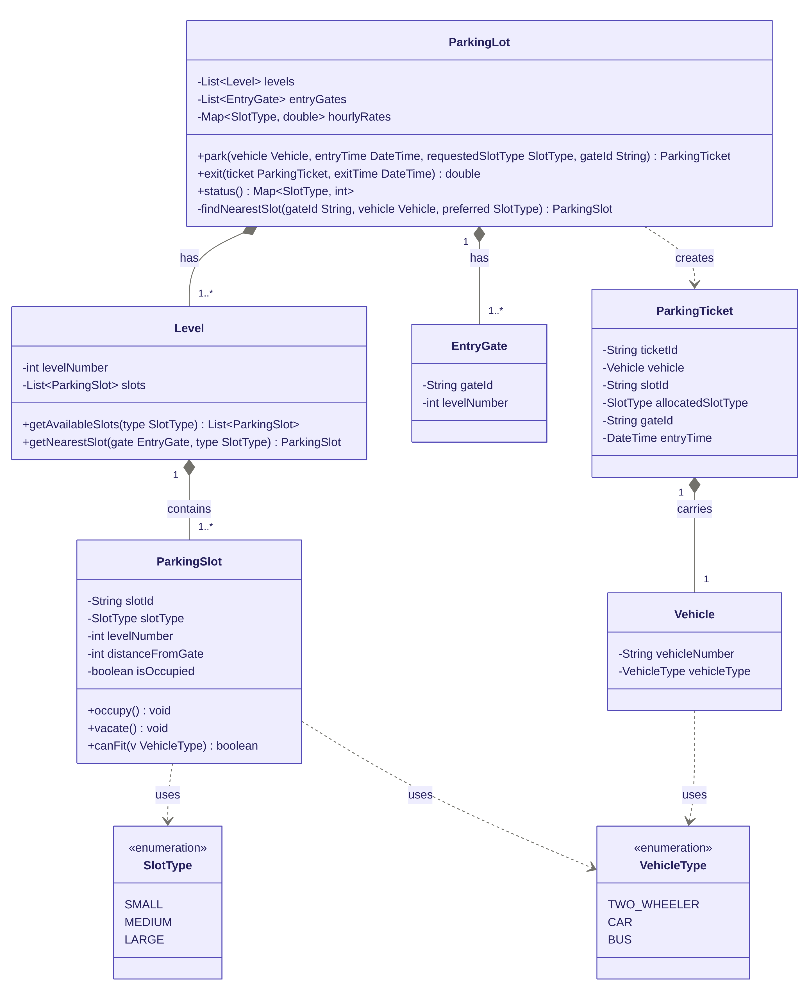

# Multilevel Parking Lot — LLD

## Class Diagram



---

## Design & Approach

### Vehicle → Slot Compatibility (`canFit`)

| Vehicle      | SMALL | MEDIUM | LARGE |
|---|---|---|---|
| TWO_WHEELER  | ✓     | ✓      | ✓     |
| CAR          |       | ✓      | ✓     |
| BUS          |       |        | ✓     |

### Slot Upgrade Order
If the requested slot type is full, the system tries the next larger compatible type:
- TWO_WHEELER requesting SMALL → SMALL → MEDIUM → LARGE
- CAR requesting MEDIUM → MEDIUM → LARGE
- BUS → LARGE only

### Billing
Billed on **allocated slot type**, not vehicle type. Duration is rounded up to the next full hour.

### Nearest Slot
`distanceFromGate` is set at slot creation time (e.g., row index). `findNearestSlot` picks the slot with the smallest `distanceFromGate` across all levels that has a compatible, available slot.

---

## Project Structure

```
parking-lot/
├── parking_lot_class_diagram.png
├── README.md
└── src/
    ├── enums/
    │   ├── SlotType.java
    │   └── VehicleType.java
    ├── Vehicle.java
    ├── ParkingSlot.java
    ├── EntryGate.java
    ├── ParkingTicket.java
    ├── Level.java
    ├── ParkingLot.java
    └── ParkingLotMain.java
```

---

## How to Run

```bash
cd parking-lot/src
javac -d out enums/*.java Vehicle.java ParkingSlot.java EntryGate.java ParkingTicket.java Level.java ParkingLot.java ParkingLotMain.java
java -cp out ParkingLotMain
```
