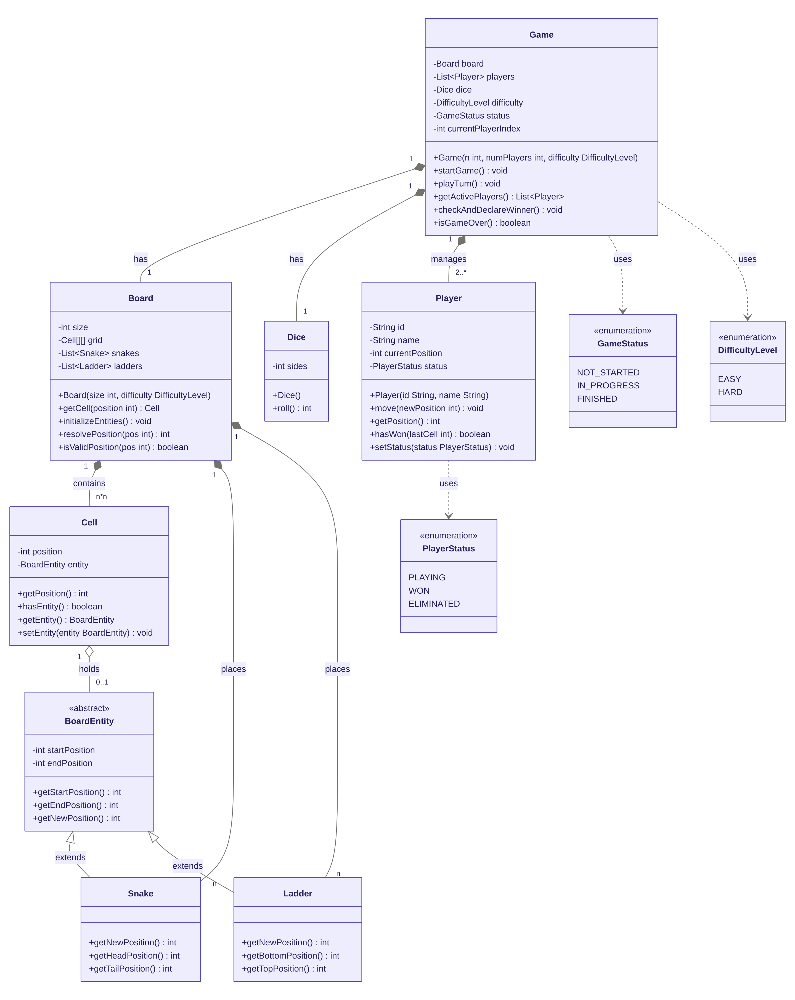

# Snake and Ladder — LLD

## Class Diagram


---

## Project Structure

```
snake-and-ladder/
├── snakes_ladders_class_diagram.png
├── README.md
└── src/
    ├── enums/
    │   ├── GameStatus.java
    │   ├── DifficultyLevel.java
    │   └── PlayerStatus.java
    ├── BoardEntity.java   ← abstract
    ├── Snake.java
    ├── Ladder.java
    ├── Cell.java
    ├── Board.java
    ├── Dice.java
    ├── Player.java
    ├── Game.java
    └── SnakeLadderMain.java
```

---

## How to Run

```bash
cd snake-and-ladder/src
javac -d out enums/*.java BoardEntity.java Snake.java Ladder.java Cell.java Board.java Dice.java Player.java Game.java SnakeLadderMain.java
java -cp out SnakeLadderMain
```
